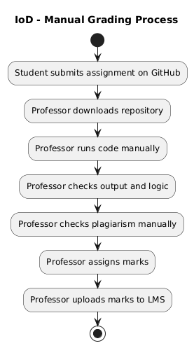
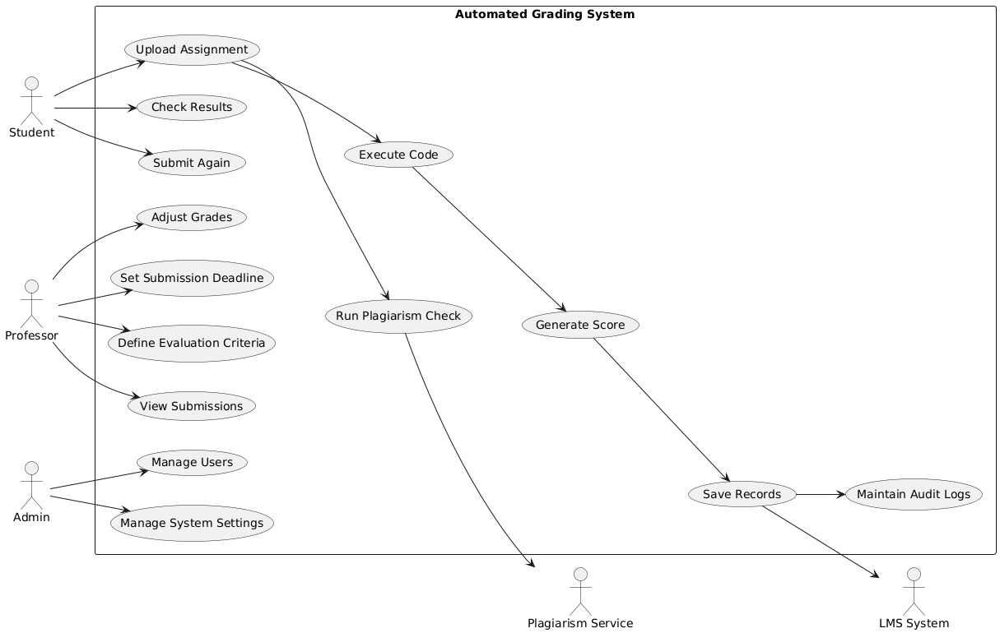
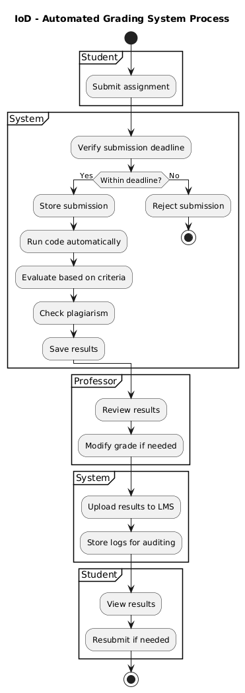

# Practical 2 – Automated Grading System (AGS)

## 1.Practical Work Overview

In this practical, I designed UML diagrams to model an Automated Grading System (AGS) for a university. Currently, the grading process is fully manual where students submit their assignments through GitHub, and professors download, run, and evaluate each submission individually. This approach is time-consuming and difficult to manage, especially with a large number of students.

The main objective of this work is to improve this process by introducing automation. The system is expected to handle submission, execution, grading, plagiarism detection, and integration with the university’s LMS.

The main business outcome considered in this design is:
“Assignments are automatically graded and the results are recorded in the LMS system.”

The work includes three main UML diagrams:

Interaction Overview Diagram (IoD) – showing the current manual process
Use Case Diagram (UCD) – defining system functionalities
Interaction Overview Diagram (IoD) – showing the automated system process

## 2. Interaction Overview Diagram (Actor-to-Actor)

Diagram (Current Manual Process)

This diagram represents how the grading process currently works without any automation. The interaction mainly happens between the student and the professor. The student submits their work, and the professor performs all the steps manually, including running the code, checking correctness, and assigning marks.

This process is slow and increases the workload on professors, especially when handling many students.

## 3. Use Case Diagram (System Functionality)

Diagram

The Use Case Diagram shows the features that the Automated Grading System must support. It identifies the main actors such as students, professors, and administrators, along with external systems like LMS and plagiarism detection services.

The system allows students to submit and resubmit assignments, while professors can set deadlines and grading rules. The system automatically runs the code, evaluates it, checks for plagiarism, and stores results securely.

## 4. Interaction Overview Diagram (With System)

Diagram (Automated Process)

This diagram shows how the system improves the interaction between users. Instead of manual work, the system now performs most of the tasks automatically. The student submits the assignment, and the system takes care of execution, grading, and plagiarism detection.

The professor’s role is reduced to reviewing and adjusting grades if necessary. The system also ensures that all results are stored and sent to the LMS, making the process more efficient and reliable.

## 5. Reflection

From this practical, I learned how UML diagrams help in understanding and designing a system clearly before implementation. Initially, it was difficult to distinguish between different diagram types, but after working on this task, I understood how each diagram serves a different purpose.

The Interaction Overview Diagram helped me understand the flow of activities, while the Use Case Diagram helped me focus on system functionalities. I also realized the importance of defining system boundaries and identifying actors correctly.

One challenge I faced was deciding how detailed the diagrams should be. However, simplifying the process and focusing on the main interactions made it easier to design clear diagrams.

## 6. Conclusion

In conclusion, this practical helped me understand how to model a real-world problem using UML diagrams. The Automated Grading System provides a better solution compared to the current manual process by saving time, reducing errors, and improving scalability.

The system ensures that grading is consistent, plagiarism is detected, and results are properly stored and shared with the LMS. Overall, this design can greatly improve efficiency in a university environment.